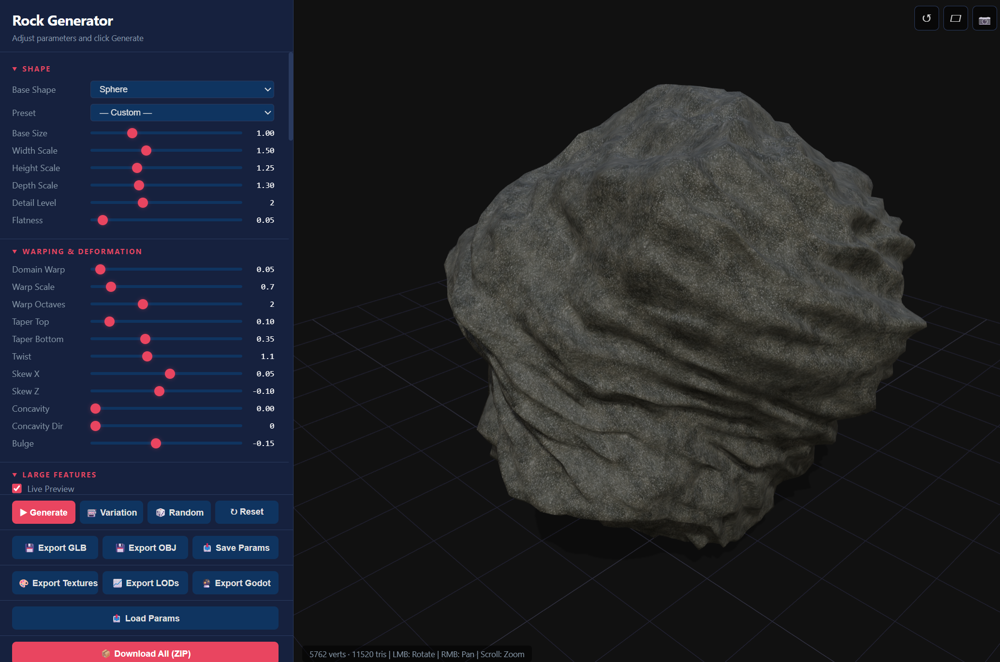

# 3D Rock Generator

A browser-based procedural rock generator built with **Three.js**. Create realistic, game-ready 3D rocks entirely in the browser — no server, no build step, no installs.



## Features

- **Procedural geometry** — Simplex noise, Worley noise, FBM, domain warping, ridge noise, cracks (9 algorithms), pitting, erosion, edge chipping, undercuts, and thermal erosion
- **12 shape presets** — Boulder, slab, stalactite, stalagmite, column, ledge, overhang, arch, spike, rubble, wall, flowstone
- **8 rock-type textures** — Granite, sandstone, slate, limestone, basalt, marble, obsidian, mossy — each with unique procedural patterns
- **PBR materials** — Triplanar projection, cavity AO, edge wear, subsurface scattering approximation
- **Vertex effects** — Ambient occlusion, curvature colouring, moss overlay
- **LOD generation** — Quadric-error-metric edge-collapse decimation at 4 levels
- **Multiple export formats** — GLB, OBJ, PNG textures, Godot (.gdshader + .tres), parameter JSON
- **One-click ZIP download** — Bundle all exports into a single ZIP
- **Live preview** — Debounced real-time regeneration as you adjust parameters
- **Variation system** — New seed + optional parameter drift for quick iterations
- **No build tools** — Pure ES modules loaded via browser `importmap`

## Quick Start

1. **Clone the repo**
   ```bash
   git clone https://github.com/YOUR_USERNAME/rock-generator.git
   cd rock-generator
   ```

2. **Start a local HTTP server** (required for ES module imports)
   ```bash
   # Python
   python -m http.server 8000

   # Node.js
   npx serve .

   # VS Code — install "Live Server" extension and click "Go Live"
   ```

3. **Open in browser** — navigate to `http://localhost:8000`

> **Note:** Opening `index.html` directly via `file://` will not work due to CORS restrictions on ES module imports.

## Project Structure

```
rock-generator/
├── index.html                 # Thin HTML shell — UI controls & script entry
├── css/
│   └── styles.css             # All CSS extracted from the original monolith
├── src/
│   ├── main.js                # Entry point — boots scene, UI, first render
│   ├── app.js                 # Core actions — generate, variation, randomize, reset
│   ├── ui.js                  # UI wiring — sliders, presets, lighting controls
│   ├── state.js               # Shared singleton state (scene, camera, mesh, etc.)
│   ├── noise.js               # SimplexNoise + Worley + FBM
│   ├── presets.js             # Rock-type colour presets & shape presets
│   ├── utils.js               # DOM helpers, param collection, OBJ builder
│   ├── textures.js            # Procedural diffuse / normal / roughness textures
│   ├── materials.js           # Triplanar PBR material with shader injection
│   ├── scene.js               # Three.js scene, lights, HDRI, render loop
│   ├── exporters.js           # GLB, OBJ, textures, LODs, Godot, ZIP exports
│   └── geometry/
│       ├── rock-generator.js  # Master geometry orchestrator
│       ├── mesh-ops.js        # Vertex welding, adjacency, subdivision
│       ├── decimation.js      # Quadric error metric edge-collapse
│       ├── displacement.js    # Noise displacement + 9 crack algorithms
│       ├── post-process-registry.js  # Effect plugin registry & runner
│       └── effects/           # Self-registering post-process effects
│           ├── spike-removal.js
│           ├── edge-chipping.js
│           ├── undercuts.js
│           ├── thermal-erosion.js
│           ├── vertex-ao.js
│           ├── curvature-color.js
│           └── moss.js
├── .gitignore
├── LICENSE                    # MIT
└── README.md
```

## Adding New Features

The codebase is designed so that each concern lives in a single, well-documented file. Here's where to add common extensions:

### New Rock Type (colour preset)

Edit [src/presets.js](src/presets.js) — add an entry to `rockPresets`:

```js
export const rockPresets = {
  // ...existing...
  pumice: { primary: '#d4c9b8', secondary: '#bfb5a3', metalness: 0.02, roughnessMap: 0.95 },
};
```

Then add a matching `<option>` in [index.html](index.html)'s `#rockType` select.

### New Shape Preset

Edit [src/presets.js](src/presets.js) — add an entry to `shapePresets`:

```js
export const shapePresets = {
  // ...existing...
  needle: { baseShape: 'cone', widthScale: 0.15, heightScale: 4, /* ... */ },
};
```

Then add a matching `<option>` in [index.html](index.html)'s `#shapePreset` select.

### New Post-Process Effect (Plugin)

The post-process pipeline uses a self-registering plugin architecture. Each effect lives in its own file under `src/geometry/effects/` and declares its UI, execution order, and dependencies.

1. Create a new file in `src/geometry/effects/`, e.g. `my-effect.js`:

```js
import { register } from '../post-process-registry.js';

register({
  id: 'myEffect',
  name: 'My Effect',
  order: 150,           // execution order (100-199 = geometry, 200+ = color)
  phase: 'geometry',    // 'geometry' modifies positions, 'color' modifies vertex colors
  needsAdjacency: true, // request lazy-built adjacency data
  needsNormals: false,
  controls: [
    { type: 'slider', id: 'myEffect', label: 'My Effect', min: 0, max: 1, step: 0.05, default: 0 },
  ],
  driftIds: ['myEffect'],  // IDs that auto-drift uses
  shouldRun(p) { return p.myEffect > 0; },
  process(geo, params, ctx) {
    // ctx.adj — adjacency (lazy, only built if needsAdjacency is true)
    // ctx.noise(seedOffset) — cached SimplexNoise instance
    // modify geo.attributes.position.array (geometry phase)
    // or geo.attributes.color.array (color phase)
    return geo;
  },
});
```

2. Add a side-effect import in [src/geometry/rock-generator.js](src/geometry/rock-generator.js):
```js
import './effects/my-effect.js';
```

That's it — the registry handles UI injection, param collection, defaults, and ordered pipeline execution automatically.

### New Crack Algorithm

Edit [src/geometry/displacement.js](src/geometry/displacement.js) — add a new case in the `crackDisplace()` switch:

```js
case 'mycrack': { /* your algorithm */ break; }
```

Then add a matching `<option>` in [index.html](index.html)'s `#crackAlgo` select.

### New Export Format

1. Write your export function in [src/exporters.js](src/exporters.js)
2. Assign it to `window` at the bottom of that file
3. Add a button in [index.html](index.html)

## Dependencies

All loaded via CDN — no `npm install` needed:

| Library | Version | Purpose |
|---------|---------|---------|
| [Three.js](https://threejs.org/) | 0.163.0 | 3D rendering, geometry, materials |
| [JSZip](https://stuk.github.io/jszip/) | 3.10.1 | ZIP file generation for bulk export |

## License

[MIT](LICENSE)
